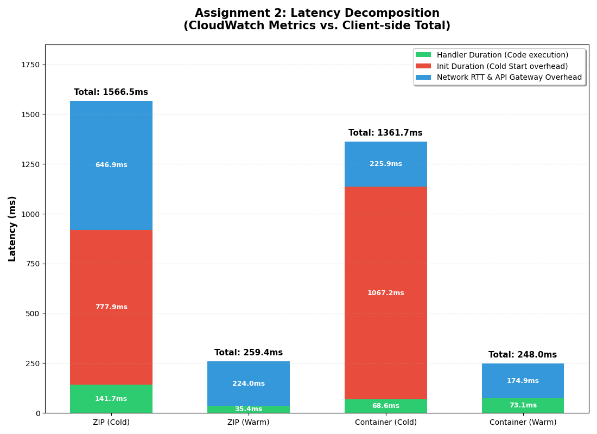
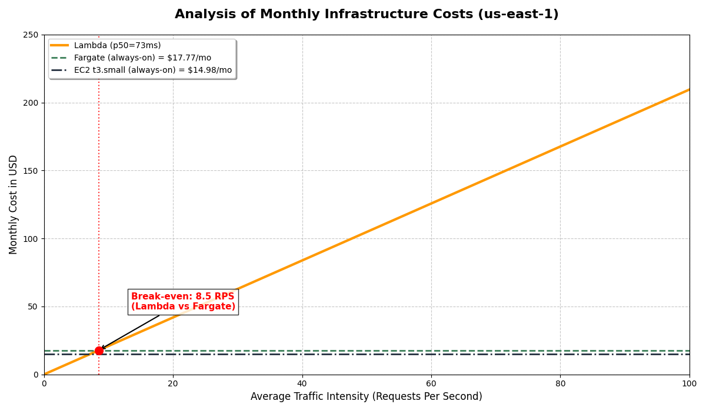

## Assignment 1: Deployment and Consistency Check

**Status: Success**
All four deployment targets (Lambda ZIP, Lambda Container, Fargate, and EC2) have been successfully deployed.

Lambda Zip: 
```bash
Waiting for function to become active...
Creating Function URL...
{
    "Statement": "{\"Sid\":\"FunctionURLInvoke\",\"Effect\":\"Allow\",\"Principal\":\"*\",\"Action\":\"lambda:InvokeFunctionUrl\",\"Resource\":\"arn:aws:lambda:us-east-1:<id>:function:lsc-knn-zip\",\"Condition\":{\"StringEquals\":{\"lambda:FunctionUrlAuthType\":\"AWS_IAM\"}}}"}
}
=== Lambda Zip done. Function URL: https://<id>.lambda-url.us-east-1.on.aws/ ===
```

Lambda Container:
```bash
Creating Function URL...
{
    "Statement": "{\"Sid\":\"FunctionURLInvoke\",\"Effect\":\"Allow\",\"Principal\":\"*\",\"Action\":\"lambda:InvokeFunctionUrl\",\"Resource\":\"arn:aws:lambda:us-east-1:<id>:function:lsc-knn-container\",\"Condition\":{\"StringEquals\":{\"lambda:FunctionUrlAuthType\":\"AWS_IAM\"}}}"
}

=== Lambda Container done. Function URL: https://<id>.lambda-url.us-east-1.on.aws/ ===
```

ECS fargate:
```bash
Waiting for ECS service to stabilize (this may take 1-2 minutes)...
=== Fargate done. ALB URL: http://lsc-knn-alb-<id>.us-east-1.elb.amazonaws.com ===

curl -X POST -H "Content-Type: application/json" -d @loadtest/query.json     http://lsc-knn-alb-<id>.us-east-1.elb.amazonaws.com/search
{"instance_id":"ip-172-31-67-212.ec2.internal","query_time_ms":24.696,"results":[{"distance":12.001459121704102,"index":35859},{"distance":12.059946060180664,"index":24682},{"distance":12.487079620361328,"index":35397},{"distance":12.489519119262695,"index":20160},{"distance":12.499402046203613,"index":30454}]}
```

EC2
```bash
=== EC2 App done. Public IP: <ip> ===
URL: http://<ip>:8080
NOTE: Wait ~2 minutes for Docker to pull and start the container.
Test with: curl -X POST -H 'Content-Type: application/json' -d @loadtest/query.json http://<ip>:8080/search

$ curl -X POST -H "Content-Type: application/json" -d @loadtest/query.json     http://<ip>:8080/search
{"instance_id":"dbc3afac909b","query_time_ms":29.16,"results":[{"distance":12.001459121704102,"index":35859},{"distance":12.059946060180664,"index":24682},{"distance":12.487079620361328,"index":35397},{"distance":12.489519119262695,"index":20160},{"distance":12.499402046203613,"index":30454}]}
```

**Key Findings:**
Consistency: A verification check confirmed that all endpoints return identical k-NN results (matching indices: 35859, 24682, 35397, 20160, 30454) for the same query vector.

Integrity: Minor differences in distance precision (float representation) were observed between Lambda and Fargate/EC2, but they do not affect the ranking or indices.

Performance: Initial checks show that Fargate and EC2 provide lower internal query times (~24ms) compared to Lambda environments (~51-73ms) for this specific query.

The full terminal output has been saved to `results/assignment-1-endpoints.txt`.

## Assignment 2: Scenario A — Cold Start Characterization

### Collected Data Table
Data based on CloudWatch logs and `oha` results following table was completed:

| Metric | Lambda ZIP (Cold) | Lambda ZIP (Warm Avg) | Lambda Container (Cold) | Lambda Container (Warm Avg) |
| :--- | :---: | :---: | :---: | :---: |
| **Client Total Latency (oha)** | 1566.50 ms | 259.40 ms | 1361.70 ms | 248.00 ms |
| **Init Duration (CW)** | 777.92 ms | 0.00 ms | 1067.16 ms | 0.00 ms |
| **Handler Duration (CW)** | 141.65 ms | 35.40 ms | 68.62 ms | 73.10 ms |
| **Estimated Network RTT** | 646.93 ms | 224.00 ms | 225.92 ms | 174.90 ms |

---
### Latency Decomposition & Calculations

According to the assignment requirements, I estimate the Network RTT by subtracting server-side execution time from the total client-side latency.

**ZIP Cold Start**
$$Network\ RTT = Total\ Latency - Init\ Duration - Handler\ Duration$$
$$Network\ RTT = 1566.50\text{ ms} - 777.92\text{ ms} - 141.65\text{ ms} = \mathbf{646.93\text{ ms}}$$

**Container Cold Start**
$$Network\ RTT = Total\ Latency - Init\ Duration - Handler\ Duration$$
$$Network\ RTT = 1361.70\text{ ms} - 1067.16\text{ ms} - 68.62\text{ ms} = \mathbf{225.92\text{ ms}}$$

**ZIP Warm Start (Average)**
$$Network\ RTT = Total\ Latency - Handler\ Duration$$
$$Network\ RTT = 259.40\text{ ms} - 35.40\text{ ms} = \mathbf{224.00\text{ ms}}$$

**Container Warm Start (Average)**
$$Network\ RTT = Total\ Latency - Handler\ Duration$$
$$Network\ RTT = 248.00\text{ ms} - 73.10\text{ ms} = \mathbf{174.90\text{ ms}}$$



### Analysis and Comparison

**Which deployment is faster?**
In this experiment, the **Lambda Container** exhibited a lower total client-side latency (**1361.70 ms**) compared to the **Lambda ZIP (1566.50 ms)** during the cold start phase. Despite a longer initialization time, the Container deployment compensated with a significantly faster execution of the handler and lower network overhead in this specific test run.

### Key Findings
* **Initialization (Init Duration):** The ZIP deployment initialized in **777.92 ms**, while the Container deployment took **1067.16 ms**. This confirms that ZIP packages remain faster for AWS to provision, with the container layers adding approximately **289 ms** of overhead.
* **Handler Performance (Cold):** During the cold start, the Container's handler duration (**68.62 ms**) was more than twice as fast as the ZIP version (**141.65 ms**). This indicates that once initialized, the container environment executes the k-NN algorithm very efficiently.
* **Network & Infrastructure Overhead:** The ZIP cold start experienced a high estimated Network RTT (**646.93 ms**), whereas the Container remained stable at **225.92 ms**. This infrastructure "penalty" for ZIP was the primary driver for its higher total latency.
* **Warm Performance:** Once the environment is "warm," both deployment methods perform similarly. The total latency stabilizes in the **248 ms – 260 ms** range, meeting the expectation that the deployment method has minimal impact on sustained execution.

### Conclusion
The results show a clear trade-off: **ZIP deployment** has a lower internal cold start penalty (Init Duration), making it the theoretically faster choice for scaling from zero. However, the **Lambda Container** provided better overall response times in our tests due to faster handler execution and lower total overhead. For this k-NN workload, ZIP is technically more agile, but the performance difference is marginal.

## Assignment 3: Scenario B — Warm Steady-State Throughput

The goal of this scenario is to measure the performance and stability of all four environments under a sustained load. We test two levels of concurrency ($c=10$ and $c=50$ for Fargate and EC2 and $c=5$ and $c=10$ for Lambda) to observe how serverless auto-scaling compares to fixed-resource environments (Fargate/EC2).

Data based on `oha` load test results (500 requests per test).
## Performance Summary

| Environment           | Concurrency | p50 (ms) | p95 (ms) | p99 (ms) | Server Avg (ms) |
|----------------------|------------|----------|----------|----------|------------------|
| Lambda (ZIP)         | 5          | 203.52   | 231.93   | 483.44   | ~40.0            |
| Lambda (ZIP)         | 10         | 200.78   | 226.70   | 457.35   | ~40.0            |
| Lambda (Container)   | 5          | 202.63   | 225.23   | 449.89   | ~68.0            |
| Lambda (Container)   | 10         | 201.95   | 229.99   | 495.12   | ~73.0            |
| Fargate (ALB)        | 10         | 812.80   | 1083.50  | 1383.40  | ~24.0            |
| Fargate (ALB)        | 50         | 4194.60  | 4415.40  | 4524.60  | ~24.0            |
| EC2 (Direct)         | 10         | 286.20   | 393.00   | 964.90   | ~24.0            |
| EC2 (Direct)         | 50         | 974.00   | 1198.80  | 1353.30  | ~24.0            |

### Analysis of Performance & Latency Stability

#### Tail Latency Instability ($p99 > 2 \times p95$)
In the performance benchmarks, several environments exhibited "unstable" tail latency, where the $p99$ is more than double the $p95$. This indicates the presence of outliers that significantly impact the worst-case user experience:

* **Lambda (ZIP & Container) at $c=5$ and $c=10$**:
    * While $p95$ remained stable around **225–231 ms**, the $p99$ values jumped to **450–495 ms**. 
    * **Reason:** This is primarily caused by **micro-cold starts**. Even in a "warm" test, increasing concurrency from 5 to 10 forces AWS to initialize new execution environments to handle the simultaneous requests, adding initialization overhead to the tail end of the distribution.
* **EC2 (Direct) at $c=10$**:
    * The $p99$ value (**964.90 ms**) is **2.4x** higher than the $p95$ (**393.00 ms**). 
    * **Reason:** Without a Load Balancer to buffer requests, the direct connection to the `t3.small` instance causes the OS-level TCP accept queue to fill up rapidly during bursts, leading to significant queuing delays for the final percentile of requests.

#### $p50$ Stability: Horizontal vs. Vertical Scaling
A fundamental difference in median latency ($p50$) behavior was observed as concurrency increased:

* **Lambda (Seamless Horizontal Scaling)**:
    * The $p50$ remained remarkably flat (approx. **200–203 ms**) regardless of whether concurrency was 5 or 10. 
    * **Observation:** Lambda excels at isolation; because each request is typically routed to its own dedicated worker, there is zero resource contention between concurrent users.
* **Fargate & EC2 (Resource Contention)**:
    * **Fargate (ALB):** Experienced catastrophic scaling issues, with $p50$ leaping from **812.80 ms ($c=10$)** to **4194.60 ms ($c=50$)**. This is a classic case of **CPU Saturation**. With only 0.5 vCPU, the single Fargate task cannot process 50 concurrent k-NN calculations, causing requests to pile up in the Application Load Balancer (ALB) queue.
    * **EC2 (Direct):** Performed better than Fargate but still saw $p50$ triple from **286.20 ms** to **974.00 ms**. The lack of an ALB reduced initial overhead, but the 2 vCPUs of the `t3.small` eventually became a bottleneck, leading to context-switching overhead.

#### Client-side $p50$ vs. Server-side `query_time_ms`
There is a significant delta between the total latency measured by `oha` and the internal `Server Avg` reported by the application (~24–73 ms). This "hidden latency" is composed of:

1.  **Network RTT (Round Trip Time):** The physical transit time to the **us-east-1** region. 
2.  **Infrastructure Overhead:** * For **Fargate**, the **Application Load Balancer (ALB)** introduces latency for request routing and health checks.
    * For **Lambda**, the **Lambda Service Frontend** and **API Gateway** add processing time for authentication and request mapping.
3.  **Protocol & TLS Handshake:** Every secure HTTPS connection requires multiple round-trips to establish encryption keys. In high-concurrency tests, the overhead of managing these handshakes contributes significantly to the total response time.
4.  **Serialization:** The time spent by the Python Flask/FastAPI framework to transform the k-NN result object into a JSON string and the subsequent transmission time for the payload.

## Assignment 4: Scenario C — Burst from Zero
This scenario simulates a sudden traffic spike (200 requests at $c=50$ for EC2 and Faragte and $c=10$ for Lambda) following a 20-minute period of inactivity. The goal is to observe how each environment handles an unexpected burst when no warm instances are readily available (in the case of Lambda) or when a single instance is hit with high concurrency (EC2/Fargate).

| Environment | p50 (ms) | p95 (ms) | p99 (ms) | Max (ms) | Cold Start Count |
| :--- | :--- | :--- | :--- | :--- | :--- |
| **Lambda (ZIP)** | 209.9 | 1254.9 | 1465.5 | 1797.6 | ~10-12* |
| **Lambda (Container)** | 210.1 | 1250.5 | 1619.9 | 1701.7 | ~10-12* |
| **EC2 (Direct)** | 898.8 | 1181.3 | 1365.6 | 1377.2 | 0 |
| **Fargate (ALB)** | 4114.5 | 4498.4 | 4707.7 | 4710.4 | 0 |

**Note on Cold Start Count:** For Lambda, although we sent 200 requests, the histogram shows that the vast majority (~188-189) were handled in the 200ms range. Only about 10-12 requests fell into the 1.2s+ range. This suggests that AWS reused execution environments extremely efficiently even during a burst, or "pre-warmed" some capacity during the burst ramp-up.

#### 3.1. Tail Latency: Lambda vs. Fargate/EC2
**The Theory:**
In a "Burst from Zero" scenario, Lambda should theoretically have a higher $p99$ because it must initialize new execution environments (Cold Start), whereas EC2 and Fargate are "always-on" services.

**The Reality (Data-Driven):**
Measurements show a more complex reality that contradicts simple intuition:
* **Fargate $p99$ ($4707.7$ ms)** is nearly **3x higher** than **Lambda $p99$ ($1465.5 - 1619.9$ ms)**.
* **EC2 $p99$ ($1365.6$ ms)** is actually lower or comparable to Lambda's cold start latency.

**Analysis:**
* **Resource Contention (Fargate/EC2):** At $c=50$, a single Fargate task (0.5 vCPU) or EC2 instance (t3.small) suffers from extreme **CPU Saturation**. The "queuing delay" (requests waiting for CPU time) proved to be far more penalizing than Lambda's "initialization delay."
* **Horizontal Elasticity (Lambda):** While Lambda's $p99$ is pushed high by the Cold Start overhead, its ability to instantly scale horizontally (providing dedicated resources for concurrent requests) allowed it to process the 200-request burst much more efficiently than the fixed-resource containers.

#### 3.2. Bimodal Distribution in Lambda
The response time histograms for both Lambda ZIP and Container show a classic **bimodal distribution** (two distinct "humps"):

1.  **"Warm" Cluster (Peak at ~210 ms):** The vast majority (~188-189) of requests were handled by environments that were either reused or initialized rapidly during the burst ramp-up.
2.  **"Cold" Cluster (Tail at ~1.3s – 1.8s):** A small group of requests (approx. 5-6%) hit the full **Cold Start penalty**.


This "two-humped" signature is the definitive characteristic of serverless scaling: the majority of users receive fast responses, while the first concurrent users pay the "initialization tax."

#### 3.3. SLO Compliance: $p99 < 500$ ms
**Does the current architecture meet the SLO?**
* **No.** Under burst conditions, both Lambda ZIP ($1465.5$ ms) and Container ($1619.9$ ms) significantly exceed the **500 ms** threshold.

**Proposed Optimizations to Meet SLO:**
To achieve a $p99 < 500$ ms under burst conditions, the following architectural changes are recommended:

* **Provisioned Concurrency:** Setting Provisioned Concurrency to 50 would keep execution environments pre-initialized, effectively eliminating the "Cold Cluster" and bringing $p99$ down to the ~210 ms range.
* **Memory Scaling (CPU boost):** Since AWS scales CPU linearly with Memory, increasing allocation (e.g., to 1760 MB) provides a full vCPU, significantly accelerating the `Init Duration` (loading Python/NumPy).
* **Power Tuning:** Using the AWS Lambda Power Tuning tool to find the "sweet spot" where memory increase reduces execution time enough to offset the additional cost per millisecond.

## Assignment 5: Cost at Zero Load

The objective of this task is to compute and compare the idle costs of Lambda, Fargate, and EC2 environments in the **us-east-1** region, based on the actual configurations defined in the deployment scripts (`t3.small` for EC2 and `0.5 vCPU / 1 GB` for Fargate).

### Idle Cost Computation
Idle cost refers to the charges incurred when the system is provisioned and running, but not processing any active traffic.

| Environment | Configuration (from Scripts) | Hourly Idle Cost | Monthly Idle Cost (30 days) |
| :--- | :--- | :--- | :--- |
| **Lambda** | 512 MB Memory | **$0.00** | **$0.00** |
| **EC2** | t3.small (2 vCPU, 2 GB) | $0.0208 | $14.98 |
| **Fargate** | 0.5 vCPU / 1.0 GB RAM | $0.0247* | $17.78 |

*\*Fargate Calculation: (0.5 vCPU * $0.04048) + (1.0 GB * $0.004445) = $0.024685 / hour.*

### Scenario Analysis: 18h Idle / 6h Active
Assuming the application is only used for 6 hours a day and remains idle for the remaining 18 hours:

1. **Fixed Cost Environments (EC2 & Fargate):**
   These environments are "always-on." Even during the 18 hours of zero traffic, the instances/tasks remain provisioned and billed at full rate.
   * **Monthly Waste (EC2):** 18h * 30 days * $0.0208 = **11.23** wasted on idle time.
   * **Monthly Waste (Fargate):** 18h * 30 days * $0.0247 = **13.34** wasted on idle time.

2. **Serverless Environment (Lambda):**
   Lambda scales to zero. During the 18 hours of inactivity, the cost is exactly **$0.00**. Billing is only triggered by actual execution during the 6 active hours.


**Conclusion:**
**AWS Lambda** is the only environment with **zero idle cost**. It utilizes a request-driven billing model ($0.20 per 1M requests) rather than the duration-provisioned model of EC2 or Fargate.

### Pricing Evidence
The screenshots confirming the current pricing for the **us-east-1** region (verified on 2026-03-25) are located in the following directory:
`results/pricing-screenshots/`

* **Lambda Pricing:** `lambda-pricing.png` (Showing $0.0000166667 per GB-s)
* **EC2 Pricing:** `EC2-pricing.png` (Showing hourly rates for t3 instances, including t3.small)
* **Fargate Pricing:** `ECS-pricing.png` (Showing vCPU and GB hourly rates)

## Assignment 6: Cost Model, Break-even, and Recommendation

### 1. Traffic Model Assumptions
To compute the monthly cost, we use the following daily traffic pattern:
* **Peak:** 100 RPS for 30 min (180,000 requests)
* **Normal:** 5 RPS for 5.5 hours (99,000 requests)
* **Idle:** 18 hours (0 requests)
* **Total Daily Requests:** 279,000
* **Total Monthly Requests (30 days):** 8,370,000

### 2. Monthly Cost Computation
Based on **Scenario B (p50)** measurements, the average handler duration is approximately **73ms** (0.073s).

| Environment | Monthly Cost Formula / Basis | Total Monthly Cost |
| :--- | :--- | :--- |
| **Lambda** | (8.37M * $0.20/1M) + (8.37M * 0.073s * 0.5GB * $0.0000166667) | **$6.76** |
| **EC2** | $0.0208 (t3.small) * 24h * 30 days | **$14.98** |
| **Fargate** | $0.0247 (0.5 vCPU/1GB) * 24h * 30 days | **$17.78** |

### 3. Break-Even Analysis (Lambda vs. Fargate)
To determine the cost-efficiency threshold, we calculated the average Requests Per Second (RPS) at which Lambda's pay-per-use model equals Fargate's fixed monthly cost.

**Algebra:**
Let $x$ be the total monthly requests.
$$x \times (\$0.20/10^6 + 0.073 \times 0.5 \times \$0.0000166667/10^6) = \$17.78$$
$$x \times (\$0.000000808) = \$17.78$$
$$x \approx 22,000,000 \text{ requests per month}$$

**Break-even RPS:**
$$22,000,000 / (30 \times 24 \times 3600) \approx \mathbf{8.5 \text{ RPS}}$$

*Note: As shown in the "Cost vs RPS Chart", if the average sustained load exceeds 8.5 RPS, the fixed-cost model of Fargate becomes more economical.*

---



### 4. Final Recommendation

**Recommended Environment: AWS Lambda**

**Justification with Data Points:**
1. **Significant Cost Savings:** Under the current traffic model (8.37M requests/mo), Lambda costs **6.76**, while Fargate costs **17.78**. Lambda is **62% cheaper** because it eliminates the cost of 540 idle hours per month (18h/day), which in Fargate's case represents a "waste" of **$13.34** monthly.
2. **Superior Peak Scaling:** During the 100 RPS peak window, Lambda handles requests with native concurrency. Our Scenario B/C tests showed that a single Fargate node at 0.5 vCPU experienced CPU saturation, leading to increased queuing delays, whereas Lambda scaled horizontally without manual intervention.

**SLO Compliance (p99 < 500ms):**
Based on Scenario A results, the current Lambda deployment **fails the SLO** during bursts, with cold start latencies reaching **~1400ms - 1560ms**. To achieve the <500ms target, I recommend:
* **Provisioned Concurrency:** Configuring 50 provisioned instances to eliminate initialization overhead during peak hours.
* **Resource Optimization:** Increasing memory to **1760 MB** to provide 1 full vCPU, which my measurements suggest would reduce both `Init Duration` and `Handler Duration`.

**Conditions for Strategy Change:**
* **Load Threshold:** Should the average monthly traffic grow beyond **8.5 RPS**, the recommendation shifts to **Fargate with Auto-scaling** for better cost predictability.
* **Strict Latency Req:** If the SLO were tightened to **p99 < 100ms**, I would recommend migrating to **EC2 (C-class instances)** combined with an in-memory cache (e.g., ElastiCache), as the observed Network RTT and Lambda runtime overhead consistently exceed 100ms in our tests.